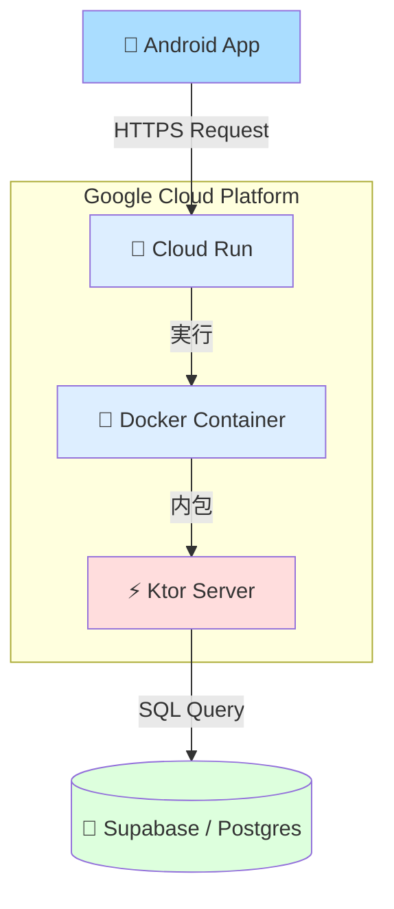

# Phase 3: バックエンド技術選定とアーキテクチャ概要

## 1. はじめに

このドキュメントでは、本プロジェクト（Cleaning Report）のバックエンド開発において **「なぜこれらの技術を選んだのか？」「それぞれの役割は何か？」** を、Android開発の知識と比較しながら解説します。

手を動かす前にこの全体像を理解することで、各フェーズの作業の意味が明確になります。

---

## 2. システム全体像

まずは登場人物の整理です。

### 各コンポーネントの役割（Androidとの比較）

| コンポーネント | 役割 | Androidで例えると | 選定理由 |
|:---|:---|:---|:---|
| **Ktor** | アプリのロジック本体 | Androidアプリのコード（Activity/ViewModel） | Kotlinで書ける、軽量、学習コストが低い |
| **Docker** | アプリが動く環境をパッケージ化 | APK/AABファイル（OSごと固めたもの） | 「私の環境では動く」問題を排除できる、デプロイが確実 |
| **Cloud Run** | Dockerを動かす場所 | ユーザーのAndroid端末（アプリが実行される場所） | 使った分だけ課金（無料枠が大きい）、サーバー管理不要 |
| **Supabase** | データの保存場所 | SQLite / Room（ただしクラウドにある） | Postgresが使える、GUIが使いやすい、Firebaseの代替 |

---

## 3. なぜこの技術構成なのか？（技術選定の背景）

### 3.1 サーバーフレームワーク: Ktor vs Spring Boot

| 特徴 | Ktor ⚡ | Spring Boot 🍃 |
|:---|:---|:---|
| **言語** | **Kotlin 100%** | Java / Kotlin |
| **開発元** | **JetBrains** (Kotlinの開発元) | Pivotal / VMware |
| **特徴** | 必要な機能だけ追加する（プラグイン方式） | 全部入り（多機能だが重い） |
| **起動速度** | **爆速**（1秒以下） | 遅い（数秒〜十数秒） |
| **学習コスト** | **低い**（Androidエンジニアにとって） | 高い（独自の「お作法」が多い） |

**結論**:
Androidエンジニアがバックエンドを始めるなら、言語の壁がなく、軽量でモダンな **Ktor** が最適解です。Spring Bootは高機能ですが、今回の規模ではオーバースペックです。Cloud Runで「使ったときだけ起動」させる運用では、Ktorの**起動の速さ**が決定的なメリットになります。

### 3.2 実行環境: Cloud Run (Serverless) vs 常時起動サーバー (EC2)

| 特徴 | Cloud Run 🏃 | EC2 (VPS) 💻 |
|:---|:---|:---|
| **稼働時間** | **リクエストがある時だけ** | 24時間365日ずっと |
| **課金体系** | **使った秒数だけ** | 起動している時間ずっと |
| **管理** | **Googleにお任せ**（OS更新など不要） | 全部自分で管理（セキュリティパッチ等） |
| **永続性** | 寝るとメモリは消える（ステートレス） | 再起動するまで残る |

**結論**:
個人開発や社内ツールでは、24時間アクセスがあるわけではありません。**「使わない時間は0円」** にできるCloud Runがコストパフォーマンス最強です。
また、インフラ管理（OSのアップデートなど）をしたくないため、Googleが管理してくれる「サーバーレス」を選びました。

### 3.3 デプロイ単位: Docker

**「なぜJarファイル（Javaの実行ファイル）を直接置かないの？」**

AndroidアプリをGoogle Playに上げるとき、ソースコードではなく署名済みの `AAB/APK` を上げますよね？ それと同じです。

*   **Jarの場合**: サーバーのJavaバージョンが違うと動かない可能性がある。
*   **Dockerの場合**: Javaのバージョンも、OSの設定も、すべてコミで「コンテナ」にするため、**「手元で動けば本番でも絶対に動く」** ことが保証されます。

---

## 4. アーキテクチャ詳細：リクエストの流れ

ユーザーがアプリで「報告ボタン」を押したとき、裏側では何が起きているのでしょうか？

### シナリオ: 「誰でもアクセスできる」とはどういうことか？

1.  **静寂（待機状態）**
    *   誰もアクセスしていない時、Cloud Run上のサーバーインスタンスは存在しません（0台）。
    *   課金：**0円**。

2.  **リクエスト発生**
    *   ユーザーが `curl https://.../health` を叩く。
    *   Google Cloudのロードバランサーがリクエストを検知。

3.  **コールドスタート（起床）**
    *   Google「おっと、リクエストだ。コンテナ起こすか」
    *   Dockerイメージからコンテナを起動（ここでKtorの `main()` が走る）。
    *   所要時間：数秒〜10秒程度（これを**コールドスタート**と呼ぶ）。

4.  **処理実行**
    *   Ktor「ようし、起きたぞ。`/health` だな、OK返すぜ」
    *   レスポンス返却。

5.  **ウォームスタンバイ（二度寝待機）**
    *   処理が終わっても、直ぐには終了しません。「次が来るかも」と数分〜15分程度待機します。
    *   この間に次のリクエストが来れば、**即座に（0ミリ秒で）** 反応します。

6.  **終了（就寝）**
    *   しばらくアクセスがないと、Google「もう来ないな、落とすか」
    *   コンテナ破棄。メモリ上のデータは消えます。

---

## 5. 各フェーズの目的との紐付け

これから行う作業が、全体の中でどこに位置するのかを確認しましょう。

- **Phase 3.1: Ktorセットアップ & Cloud Run** (完了)
    - **目的**: 「器」を作る。
    - **状態**: 空っぽのKtorサーバーが、世界中からアクセスできる状態で動いている。ただしデータは保存できない。

- **Phase 3.2: DB接続 & CRUD** (次ここ！)
    - **目的**: 「脳みそ」を作る。
    - **なぜ**: Cloud Runは寝ると忘れるので、別途Supabase（Postgres）にデータを記録する必要がある。

- **Phase 3.3: 認証実装**
    - **目的**: 「鍵」をかける。
    - **なぜ**: 今はまだ `--allow-unauthenticated` で誰でもウェルカムな状態。特定の人しか使えないようにする。

- **Phase 3.4: Flutter接続**
    - **目的**: Androidアプリと繋ぐ。
    - **なぜ**: 今は `curl` コマンドでしか使っていない。アプリからRetrofit等で呼べるようにする。

---

## 6. まとめ

開発者が意識すべきは以下の3点だけです：

1.  **Ktorでロジックを書く**（普通のKotlinコード）
2.  **Dockerで包む**（動く環境ごと固める）
3.  **Cloud Runに投げる**（あとはGoogleよろしく）

このサイクルを回すことで、バックエンド開発を進めていきます。
